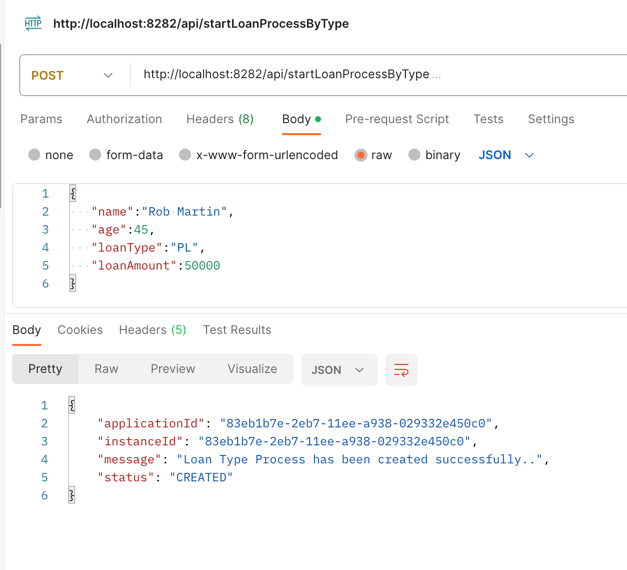
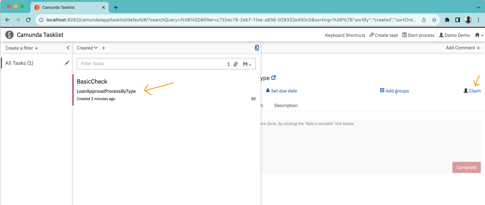
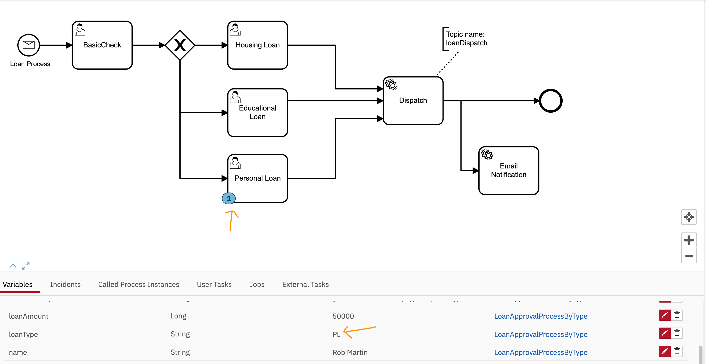
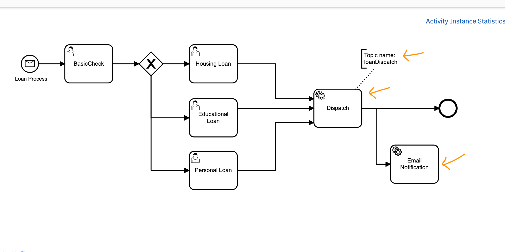
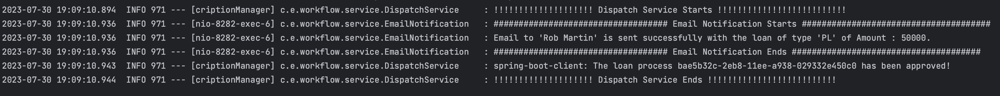
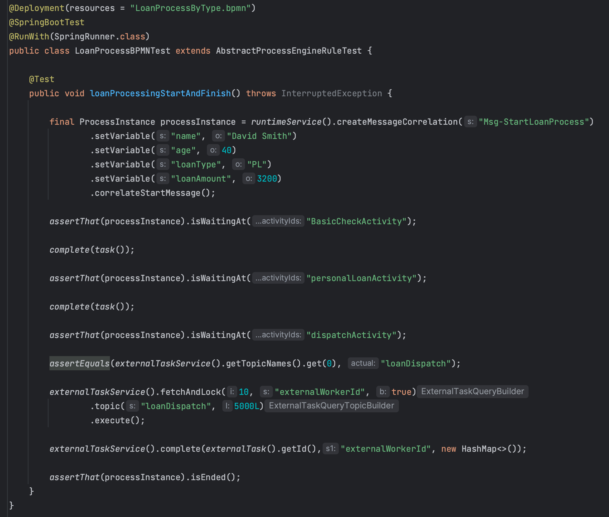
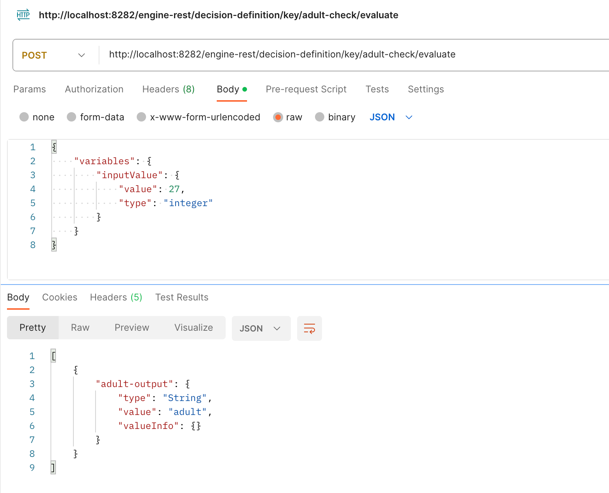

# 1. LoanProcessCheck

- Start the application

- Create Loan Process through postman using below CURL command

curl --location 'http://localhost:8282/api/startLoanProcessByType' \
--header 'Content-Type: application/json' \
--data '{
"name":"Rob Martin",
"age":45,
"loanType":"PL",
"loanAmount":50000
}'

- Login to Camunda Console

http://localhost:8282/

Username : demo
password: demo

- Search the Tasklist, claim the task and Complete it

- As per the payload the loan type is "PL" and it will go the Personal Loan process, claim the task and Complete it

- Once the Loan type task completed the flow will move to Dispatch and Email notification. 

- The Dispatch task is added as a external task and the task will be added to the 'loanDispatch' topic for the further process.
The Email notification is configured as a Delegate task and both will execute parallel.

- As part of the Dispatch Service and Email Notification, we could see the below logs in the console.

- Unit Test case for the Personal Loan process

# 2. Adult or Child Decision
- Decision Model Check

curl --location 'http://localhost:8282/engine-rest/decision-definition/key/adult-check/evaluate' \
--header 'Content-Type: application/json' \
--data '{
"variables": {
"inputValue": {
"value": 27,
"type": "integer"
}
}
}'

